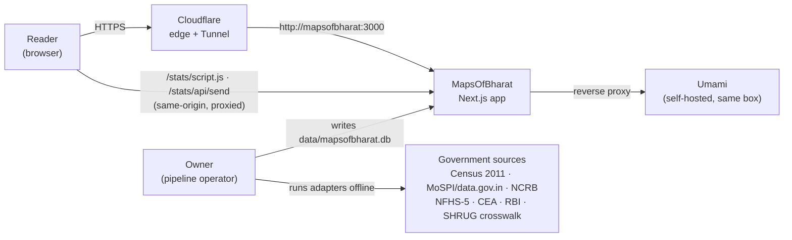
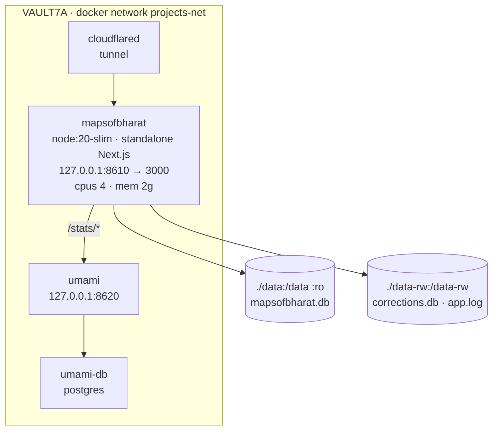

# MapsOfBharat — Architecture

System design for MapsOfBharat, in the arc42-lite shape with C4 levels 1–3.
As of commit `4e7b1ef` (branch `iter-37-2026-08-11`), 2026-08-11.

This document explains **why the system is built the way it is**. It deliberately
does not list what the product does — that catalogue is generated from the
Ottomate registry into [`FEATURES.md`](FEATURES.md) and must not be restated here.

---

## 1. Introduction & Goals

MapsOfBharat renders official Indian statistics as an interactive choropleth that
drills India → state → district, with every number carrying its source, year and
methodology.

Three quality goals drive the architecture, in order:

1. **Provenance honesty.** A value must be traceable to the government table it
   came from, and a value that was *not* measured for a district must say so —
   what kind of estimate it is, and which district it was inherited from. This is
   a data-model requirement, not a UI one: `metric_values` carries the estimate
   flag and `district_estimate_source` carries the donor.
2. **Correctness of the map itself.** Census-2011 data and today's district
   boundaries do not agree. Reconciling them is the hardest part of the system,
   and a silent regression there is invisible to a reader. Both the boundary set
   and the reaggregation are guarded by checks that fail the build.
3. **Cheap, boring operation.** One person operates this alongside a full-time
   job. The system is a single container reading a single file; there is no
   cluster, no queue, no runtime database server, and nothing to page anyone
   about at 3 a.m.

Non-goals are recorded in
[`decisions/adr-028-positioning-and-non-goals.md`](decisions/adr-028-positioning-and-non-goals.md)
and [`does-not-claim.md`](does-not-claim.md).

## 2. Constraints

| Constraint | Consequence |
|---|---|
| Data is published as spreadsheets and PDFs on ~20 government portals, on no schedule | Ingestion is offline, per-source, and human-initiated; no source is called at request time (adr-004) |
| Boundaries must be Survey-of-India compliant | The boundary GeoJSON is committed to the repo and fingerprinted in CI; it is never fetched or generated at runtime |
| The sub-district crosswalk is SHRUG-derived, CC-BY-NC-SA | The site stays strictly non-commercial until the crosswalk is swapped to LGD (adr-027, to-do #384) |
| Solo operator, shared 47-container home server | Hard CPU/memory caps on the container; no service that needs babysitting |
| India's DPDP Act; no appetite for intermediary duties under the IT Rules 2021 | Cookieless first-party analytics only, no accounts, no user-generated content (adr-029) |
| The canonical store is ~12 MB and gitignored | CI can build and typecheck without data; every read path must tolerate a missing DB |

## 3. Context (C4 level 1)

Two things are load-bearing in this picture:

- **The browser only ever talks to one origin.** The analytics script and its
  collect endpoint are reverse-proxied at `/stats/*` (`next.config.ts` rewrites),
  the map draws from GeoJSON served out of `public/geo/`, and fonts are
  self-hosted by `next/font`. There is no third-party host on the page — no tile
  server, no CDN script, no analytics vendor.
- **Government sources are upstream of the build, not of the request.** No
  request the reader makes reaches a government API. The offline pipeline is the
  only thing that ever talks to them, and the only thing that ever writes data.

The Ottomate tracker (`http://127.0.0.1:8110`) is a *development-time* dependency
only: it is the registry [`FEATURES.md`](FEATURES.md) is generated from. The
running site does not know it exists.

## 4. Solution Strategy

| Problem | Approach | Recorded in |
|---|---|---|
| Sources are slow, rate-limited and unreliable | Own the data: scheduled offline ingestion into one canonical SQLite store, zero live calls at request time | adr-004 |
| Old data, new boundaries | Store at the finest available unit (2011 sub-district), reaggregate onto current districts through a crosswalk, and keep an as-reported-2011 vintage toggle | adr-003, adr-010 |
| Every dataset has its own shape | A thin adapter per dataset (`pipeline/ingest_*.py`) over a shared matcher (`region_match.py`) and one canonical key | adr-006 |
| Estimates are indistinguishable from measurements once rendered | Discriminate the estimate kind in the schema, cite the donor district per value, and disclose at the point of reading rather than painting the map | adr-019, adr-020, adr-021 |
| A data regression is invisible | Baseline the store in `pipeline/expectations.json` and re-validate against it; fingerprint the boundary geometry in CI | — |
| Operational cost must stay near zero | One stateless container over a read-only file; no DB server, no cache tier, no background workers | — |

The one architectural rule everything else follows from: **the app is a reader.**
`lib/db.ts` opens the store `readonly` with `fileMustExist` and sets
`query_only`, the container mounts `./data` as `:ro`, and the only writes that
happen anywhere in the running system are the private corrections store and the
error log, both on a separate writable mount.

## 5. Building Blocks

### 5.1 Containers (C4 level 2)

The two mounts are the whole storage story. `./data` is read-only *at the mount*,
so the isolation `lib/db.ts` declares is also enforced by the platform. `./data-rw`
is host-owned by uid 1001 (the container user) so the two features that genuinely
need to write — correction reports and the file error sink — actually can; both
silently failed for months when they shared the read-only mount.

The Umami dashboard itself is bound to loopback only. The public site exposes
exactly two Umami paths, `/stats/script.js` and `/stats/api/send`; nothing else
under `/stats` is reachable from the internet.

### 5.2 Components (C4 level 3)

**Canonical store** — `data/mapsofbharat.db`, six tables:

| Table | Holds |
|---|---|
| `metrics` | one row per statistic: name, category, unit, decimals, `higher_is_better`, default scale, description, `source`, `source_url`, `license`, year, methodology |
| `metric_values` | the numbers — PK `(metric_id, region_code, region_level, year)`, plus `estimated` and `estimate_kind` |
| `region_keys` | the canonical region index — level, code, name, `st_code`, and the second keys `census2011_dt_code`, `lgd_code`, `iso_3166_2` |
| `crosswalk` | `(sd_code, rid, method)` — 2011 sub-district to current district, recording *how* each row was mapped |
| `district_estimate_source` | for an estimated value: the donor `source_code`/`source_name`, its `divergence`, and a `shaky` flag (adr-020, inheritance grading) |
| `load_log` | one row per adapter run — adapter, source, year, licence, fetched/loaded timestamps, rows written |

The join key is `rid = "<st_code>_<dt_code>"`, and it is the same string in three
places: `metric_values.region_code`, `region_keys.code`, and the `rid` property
on every feature in `public/geo/districts.geojson`. Keeping those three in
lockstep is the single most important invariant in the repo.

**Web app** (`app/`, `components/`, `lib/`)

- `app/page.tsx` is the explorer — the homepage *is* the map (adr-015). It does
  nothing but dynamically import `components/india-map.tsx` with `ssr: false`.
- `components/india-map.tsx` is the map client: MapLibre GL over a style with
  **no sources and no basemap** (a solid background layer), into which
  `districts.geojson` and `states.geojson` are added as sources on load, and the
  as-reported-2011 pair lazily on first toggle. Long-lived MapLibre handlers read
  mirror refs rather than React state; shareable view state (`m, mode, st, stn,
  cmp, rev`) lives in the URL query and is synced with `history.replaceState`.
- `components/atlas/*` is the panel furniture around the map — chooser, search
  modal, left stack, right rail, share menu, social-export dialog, data table,
  citation block, lineage, corrections form.
- `lib/` holds the pure logic the UI and the API share: `breaks.ts` (seven class-
  break methods and the curated ramp set), `coverage.ts` (the provenance classes),
  `estimate-kind.ts`, `source-sigil.ts` (the curated publisher-key table),
  `social-export.ts`, `metric-page-data.ts`, `site.ts` (the two base URLs),
  `analytics.ts` (the SSR-safe Umami wrapper), `log.ts`, `db.ts`,
  `corrections-db.ts`, `ip.ts`.
- Read APIs are thin SQL: `/api/metrics`, `/api/metrics/[id]`, `/api/regions`,
  `/api/region/[code]`, plus `/api/health` (which reports the running commit) and
  the two write-side routes `/api/log` and `/api/corrections`. Every one of them
  handles `db() === null` by answering empty, so the app builds and runs without
  the data volume.

**Pipeline** (`pipeline/`) — Python, run by hand in a venv, never by the app.

- ~50 `ingest_*.py` adapters, one per dataset, all calling into `region_match.py`
  for name → `rid` resolution. The matcher tries exact normalised match, then
  word-sorted match, then a curated alias table of pre-2014 district renames,
  then fuzzy match within the same state at a 0.82 cutoff — logged, so a fuzzy
  hit is auditable rather than silent.
- `reaggregate.py` rolls 2011 sub-district counts into current districts and
  **refuses to write** if a metric's reaggregated median moves more than 2% from
  the source.
- `expectations.json` is the committed baseline (metric count, district coverage,
  per-metric district counts); `validate_drift.py` re-checks the live DB against
  it and exits non-zero on drift, wired to cron through
  `scripts/validate-and-notify.sh`, which reports failures into the app's own
  error sink.
- `test_pipeline.py` (pytest) covers structure, coverage, orphans and finiteness.

## 6. Runtime Scenarios

**Reader explores a metric.** `GET /` returns the app shell; the map client
fetches `/geo/districts.geojson` and `/geo/states.geojson` (`max-age` a day,
`stale-while-revalidate` a week) and `/api/metrics` in parallel. Picking a
metric fetches its values, computes class breaks in `lib/breaks.ts` and paints
feature state by `rid`. Colouring waits on both map-ready and a selected metric;
the metric list never waits on `map.on("load")`. The chosen view is written into
the URL query, which is what makes a permalink possible at all.

**Reader drills into a state.** The drill is client-side — the district polygons
are already loaded — so it costs one fetch for the state's district values, not a
navigation.

**Reader reports a data error.** `POST /api/corrections` writes to
`/data-rw/corrections.db` (a *separate* writable SQLite file, WAL) with a hashed
IP and no raw IP. Nothing submitted is ever published; the public corrections log
is owner-curated editorial content (adr-029). If the writable mount is
unavailable the route answers 503 rather than crashing, and `GET` on the same
route fails closed with 503 unless `CORRECTIONS_ADMIN_TOKEN` is set.

**A client-side error happens.** `components/client-error-reporter.tsx` posts to
`/api/log`; `lib/log.ts` always writes the line to stdout (captured by
`docker logs`) and best-effort appends JSON-lines to `LOG_PATH`. There is no
third-party error tracker.

**Owner ingests a dataset.** Adapter runs offline → `region_match` resolves names
to `rid` → rows upsert into `metric_values` → `pytest` and `validate_drift.py`
confirm the store still matches `expectations.json` → the new `data/mapsofbharat.db`
is placed on the host → the container is restarted. No app code changes.

**Deploy.** `GIT_SHA` and `GIT_DIRTY` are passed as build args, baked into the
image as env and OCI labels, and reported by `/api/health` — so "which commit is
actually serving this?" is answerable rather than inferred, and `tree=dirty`
announces that the image contains uncommitted work.

## 7. Deployment

- **Image:** three-stage `Dockerfile` on `node:20-slim` (deps → builder →
  runner). Only `.next/standalone`, `.next/static` and `public/` reach the
  runner; it runs as the non-root `nextjs` user (uid 1001) and healthchecks
  itself against `/api/health` every 30s.
- **Container:** `docker-compose.yml` — `cpus: 4`, `mem_limit: 2g`,
  `restart: unless-stopped`, published on `127.0.0.1:8610` only, joined to the
  external `projects-net` network.
- **Ingress:** Cloudflare Tunnel. `cloudflared` maps
  `mapsofbharat.vault7a.xyz → http://mapsofbharat:3000` over `projects-net`; the
  published loopback port is for local checks and the Playwright suite, not for
  the public path. Cloudflare is therefore also the traffic layer — volume, cache
  hit ratio, origin load, country and bot score — as recorded in
  [`measurement-runbook.md`](measurement-runbook.md).
- **The public domain is not live yet.** `lib/site.ts` keeps `CANONICAL_URL`
  (`mapsofbharat.in`, used for citations, robots and the sitemap) separate from
  `SITE_URL` (the origin actually served today, used for `metadataBase`,
  canonicals and OG images). The switchover is a one-line change.
- **CI** (`.gitea/workflows/ci.yml`) runs on every branch: `check-adr-refs.sh`
  (every `adr-NNN` token in the repo must resolve in
  `ottomate/decisions/index.yaml`), `check-boundaries.mjs` (checksum + geometry
  fingerprint + territorial-extent asserts on the boundary GeoJSON), `npm ci`,
  `tsc --noEmit`, lint, `npm run build`. The Playwright suite needs a served app
  and the gitignored DB, so it is gated behind the `RUN_TESTS` variable and runs
  nightly on the server instead.
- **Backups:** `scripts/backup-db.sh`; dated `.bak-*` copies of the store sit
  beside it in `data/`.

## 8. Cross-cutting Concepts

**Read-only by construction.** Stated in `lib/db.ts` (`readonly`, `query_only`,
`fileMustExist`), enforced by the `:ro` bind mount, and documented as a rule in
`CODING_GUIDELINES.md`. Writes live on a separate mount and a separate database
handle.

**Degrade, don't crash.** `db()` returns `null` when the store is absent and
every caller handles it; the corrections store returns `null` and the route
answers 503; the file log sink warns once and falls back to stdout; the analytics
wrapper no-ops during SSR and swallows every error, because analytics must never
break the page.

**Security headers.** `next.config.ts` sets `X-Content-Type-Options: nosniff`,
`Referrer-Policy: strict-origin-when-cross-origin` and a baseline
`frame-ancestors 'self'`; `middleware.ts` then sets
`frame-ancestors 'none'` for pages and `frame-ancestors *` for `/embed`, the one
view built to be iframed — and adds `X-Robots-Tag: noindex, nofollow` there so a
header-only crawler skips it.

**Rate limiting.** `middleware.ts` allows 120 requests per IP per minute on
`/api/*`, in-memory and per-instance. Loopback and RFC-1918 callers are exempt,
because the Playwright suite and local data scans exceed the limit and a
rate-limited response is easy to misread as an empty one. The exemption trusts
`x-forwarded-for`, which is safe only because the app is never exposed without a
proxy that overwrites that header — a property of the Cloudflare Tunnel path
above, and a constraint on any future ingress change.

**Caching.** `/geo/*` is cached a day with a week of `stale-while-revalidate`;
`GET /api/(metrics|region|regions)` gets `max-age=300, s-maxage=86400`. The
canonical store only changes at ingestion waves, so this is safe. Edge caching of
the API JSON additionally requires a Cloudflare Cache Rule that does not exist
yet — until it does, those headers buy browser caching and readiness only.

**Privacy.** Cookieless, self-hosted, same-origin analytics; no accounts; no
user-generated content; IP addresses hashed or truncated, never stored raw;
12-month retention then aggregate-only. See [`measurement-runbook.md`](measurement-runbook.md)
and the published `/privacy` page.

**Provenance.** Every metric carries `source`, `source_url` and `year`, and any
view that shows a value shows them. Estimated values carry their kind and their
donor district. Rankings exclude copies (adr-022, adr-023).

**Voice.** All prose — site copy, methodology notes, generated captions, and this
document — follows [`VOICE.md`](VOICE.md): impersonal, plain, sourced, no
verdicts.

## 9. Decisions

The register is [`DECISIONS.md`](DECISIONS.md); the bodies live in `decisions/`
and the machine-readable index is `ottomate/decisions/index.yaml`, which CI
checks every `adr-NNN` token in the repo against.
The decisions that shape this document most:

| ADR | Decision |
|---|---|
| adr-003 / adr-010 | store at the finest unit, render onto current-day boundaries via a crosswalk — [body](decisions/2026-06-09-reaggregate-subdistrict-crosswalk.md) |
| adr-004 | own the canonical store; no live source calls at request time |
| adr-005 | official sources only, and every metric carries its citation |
| adr-015 | the explorer is the homepage — [body](decisions/2026-07-02-atlas-ui-overhaul.md) |
| adr-019 / adr-020 / adr-021 | estimates are disclosed at the point of use, cite their donor district, and record their kind — [disclosure](decisions/2026-07-16-estimate-disclosure.md) · [citation](decisions/2026-07-16-estimate-citation-key.md) · [kind](decisions/2026-07-16-estimate-kind.md) |
| adr-022 / adr-023 | statistics and ranks exclude copies — [stats](decisions/2026-07-16-stats-exclude-copies.md) · [ranks](decisions/2026-07-18-ranks-follow-stats-membership.md) |
| adr-024 | dropped the Economic-Census metrics rather than ship non-commercially-licensed data — [body](decisions/2026-07-18-drop-shrug-ec13.md) |
| adr-025 | classification follows each metric's distribution — [body](decisions/2026-07-27-classification-method-selection.md) |
| adr-027 | accept the CC-BY-NC-SA crosswalk while non-commercial; swap to LGD before monetising — [body](decisions/adr-027-shrug-crosswalk-accept.md) |
| adr-028 | positioning and non-goals — [body](decisions/adr-028-positioning-and-non-goals.md) |
| adr-029 | no user-generated content on the public site — [body](decisions/adr-029-no-user-generated-content.md) |
| adr-030 | the component-pick gate applies to new components, not fixes — [body](decisions/adr-030-component-pick-gate-scope.md) |

## 10. Risks & Debt

- **Licence exposure on the crosswalk.** Every Census-2011 value rendered onto a
  current-day district rides the SHRUG-derived sub-district crosswalk, which is
  CC-BY-NC-SA. Monetisation is gated on swapping it for the LGD sub-district
  table (adr-027, to-do #384).
- **Two districts uncovered.** `pipeline/README.md` records coverage at 730 of
  732 current districts, and reaggregated total population about 1.6% below the
  census total — sub-districts with no PCA row or a failed point-in-polygon land
  in no current district (adr-010). Expected and documented, not fixed.
- **The rate limiter is per-instance and in-memory.** It resets on restart and
  would not survive a second replica. The second layer at the proxy is still
  outstanding.
- **The write-side stores have no schema migrations.** `corrections-db.ts` does
  `CREATE TABLE IF NOT EXISTS` and nothing else; a column change there is a
  manual operation.
- **API edge caching is declared but not active** — the Cloudflare Cache Rule
  does not exist yet, so `s-maxage` currently buys nothing at the edge.
- **Declared-but-unused dependencies.** `drizzle-orm`, `drizzle-kit`, `recharts`
  and `zustand` are in `package.json` with **no import anywhere in `app/`,
  `lib/`, `components/` or `pipeline/`**. All SQL is raw `better-sqlite3`
  prepared statements, state is React state plus mirror refs plus the URL query,
  and no chart component uses Recharts. adr-007 and `CODING_GUIDELINES.md` still
  describe drizzle and Recharts as part of the stack; that description is stale.
- **No keyboard / screen-reader audit.** Tracked as risk #57 in
  `CODING_GUIDELINES.md`; individual contrast and hit-target fixes have landed
  (adr-030) but the full audit has not been run.
- **`data/` carries seven historical `.bak-*` copies of the store** alongside the
  live one — roughly 60 MB of untracked state with no retention rule. Useful, and
  unmanaged.
